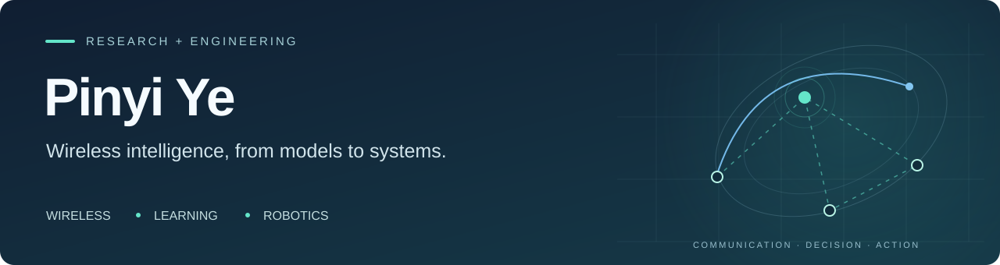

<b>中文</b> · <a href="./README.en.md">English</a>

# 你好，我是叶品驿 👋

**浙江工业大学 · 健行学院 · 通信工程本科生**  
无线通信与边缘计算 · 深度强化学习 · 机器人系统

我关注无线通信系统中的资源分配与决策问题，也喜欢把算法落到可运行的工程流程中。目前主要研究**流态天线赋能的无人机辅助移动边缘计算与安全传输**，并参与 ROS 机器人、AI 能源应用和数学建模项目。

[科研项目](#科研项目) · [工程实践](#工程实践) · [AI＋能源](#ai能源应用) · [数学建模](#数学建模) · [经历与荣誉](#经历与荣誉) · [联系我](#联系我)

## 精选项目

### 科研项目
#### 01 / 流态天线 × 无人机边缘计算

**独立项目负责人 · 2025.05 — 至今**  
`Wireless Communications` `UAV-MEC` `FAS` `DDQN + PPO`

围绕安全传输与边缘计算服务，研究无人机轨迹和通信计算资源如何协同决策。

- **系统建模**：将流态天线端口选择、任务卸载、功率控制、时隙分配与安全传输约束纳入统一优化模型。
- **算法设计**：设计 DDQN 与 PPO 联合优化框架，分别处理离散资源与端口决策、连续无人机轨迹决策。
- **仿真分析**：结合通信链路、安全速率与任务计算模型，开展性能分析和结果可视化。

[项目介绍 →](./projects/uav-mec.md) · [已公开的仿真脚本片段 ↗](https://github.com/ye056343-collab/yep)

### 工程实践
#### 02 / 智服小车 · ROS 室内自主搬运机器人

**项目实践 · 2026.01 — 2026.08**  
`ROS` `Navigation` `AprilTag` `State Machine`

把定位、导航、识别和抓取串成完整任务流程，让机器人完成室内物块自主搬运。

- **感知与执行**：集成激光雷达建图定位、AprilTag 标签识别和机械臂吸附抓取。
- **任务编排**：通过状态机协调自主导航、目标识别、搬运放置与返回终点。
- **现场调试**：围绕到位精度和放置偏差，开展 DWA 与代价地图参数整定、机械臂回零校准和动作顺序修正。

🏆 中国高校智能机器人创意大赛一等奖 · 2026  
[项目介绍 →](./projects/ros-service-robot.md)

### AI＋能源应用
#### 03 / 壳牌 × 杭州 · AI能源大脑

**团队项目 · 2026**  
`AI for Energy` `Product Prototyping` `Charging Optimization` `Business Analysis`

围绕“智选站点—到站充电—权益复充”，探索 AI 如何连接车主补能体验与场站经营决策。

- **AI 技术方案**：参与需求与排队预测、站点推荐、滚动功率优化和个性化权益的方案设计。
- **产品原型**：参与充电服务小程序概念原型，将站点选择、充电解释与会员权益串联成可演示流程。
- **商业与展示**：参与场景分析、20 站试点规划与 ROI 情景测算，以及 PPT 制作和路演。

🥈 壳牌 AI＋能源比赛 **银奖** · 2026  
[项目介绍 →](./projects/shell-ai-energy.md) · [体验概念原型 ↗](https://hawk-knko.upma.site/)

### 数学建模
#### 04 / NIPT 检测时点与分组优化

**核心成员 · 2025.09 — 2025.11**  
`Statistical Modeling` `MILP` `Machine Learning`

从相关性分析出发，将 BMI 分组与检测时点选择转化为带约束的优化问题。

- **统计分析**：使用 Spearman 相关性、BMI 分层与二次回归，分析 Y 染色体浓度、孕周和 BMI 的关系。
- **优化建模**：以混合整数线性规划处理连续分组、最小样本量和检测时点范围等约束。
- **分类评估**：融合染色体 Z 值、测序质量与母体特征，使用逻辑回归和随机森林，并以 AUC、Recall、F1 评估。

🏆 全国大学生数学建模竞赛国家二等奖 · 2025  
[项目介绍 →](./projects/nipt-optimization.md)

> **项目公开状态**：以上项目页为经历与方法介绍。UAV-MEC 仓库目前公开的是脚本片段，尚不构成完整可复现工程；机器人与数学建模项目尚未在此提供代码、演示或数据下载。AI 能源项目提供竞赛概念原型，试点规模与 ROI 属于方案测算。

## 当前关注

- **无线通信与边缘智能**：流态天线、无人机辅助移动边缘计算、安全传输。
- **混合决策优化**：离散资源分配与连续轨迹控制的联合建模和深度强化学习。
- **从算法到系统**：仿真分析、结果可视化，以及机器人感知、导航、执行模块之间的协同。

- **AI 能源应用**：充电服务原型、用户体验与场站运营决策的结合。

## 技术与工具

| 领域 | 实践内容 |
| :--- | :--- |
| 编程与计算 | Python · MATLAB · C/C++ |
| 建模与算法 | 数学建模 · 优化建模 · 机器学习 · DDQN · PPO |
| 机器人 | ROS · AprilTag · DWA 调参 · 任务状态机 |
| 分析与工程软件 | Origin · SPSS · Visio · AutoCAD · SolidWorks |

## 经历与荣誉

**浙江工业大学 · 健行学院**  
通信工程本科 · 2024.09 — 至今  
GPA **4.68 / 5** · 专业排名 **1 / 127** · IELTS **6.5**

- **2026** · 壳牌 AI＋能源比赛 **银奖**
- **2026** · 中国高校智能机器人创意大赛 **一等奖**
- **2026** · 美国大学生数学建模竞赛 **Honorable Mention**
- **2025** · 全国大学生数学建模竞赛 **国家二等奖**
- **2025** · 浙江省高等数学竞赛 **一等奖**

其他荣誉

- 浙江省大学生物理（理论）创新竞赛三等奖 · 2024
- 浙江工业大学大学物理竞赛三等奖 · 2025
- 创新创业奖学金 · 2025
- 优云企业奖学金 · 2025

## 联系我

欢迎交流**无线通信、强化学习、机器人系统与数学建模**，也期待相关科研与工程实践机会。

📫 [yepinyi@zjut.edu.cn](mailto:yepinyi@zjut.edu.cn) · [GitHub](https://github.com/ye056343-collab)

💬 **微信**：`Yeovigor`（添加时请备注 GitHub）  
📕 **[小红书 · 吟](https://xhslink.cn/o/2h8YnsbnMNE)** · 小红书号 `902102864`
